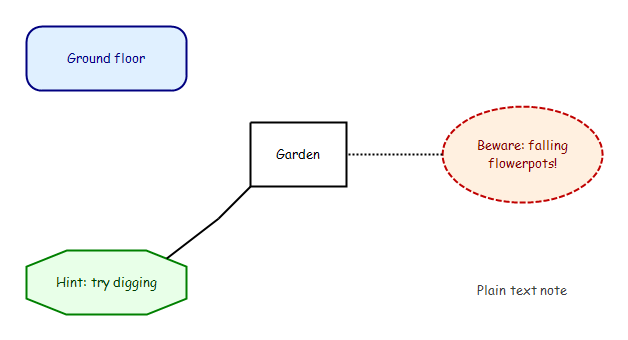
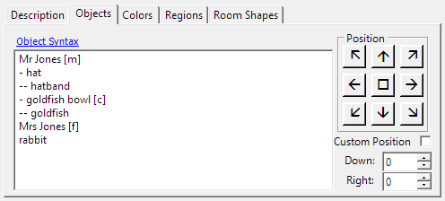
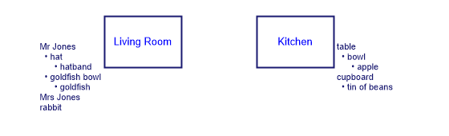
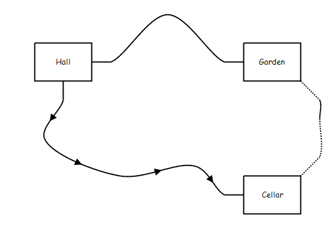

# Using Trizbort

> This guide originates from [the original HTML guide](index.shtml) and is evolving as new features are added. Much of the original text describes Trizbort 1.5.x; historical build instructions, settings paths and support links may not apply to current releases. For current build instructions, see [the developer reference](../agent-docs/09-build-test-and-dotnet8-port.md).

This guide explains how to use Trizbort.

The original version of this guide, without which additional features would never have been added, may be found at [Genstein's Trizbort site](http://trizbort.genstein.net). . The help file is [here](http://trizbort.genstein.net/help/). The HTML source can be found at [Genstein's Trizbort repository](https://github.com/genstein/trizbort/tree/master/Docs/).

The version of this guide for 1.5+ may be found at [Jason Lautzenheiser's Trizbort repository (development)](https://github.com/jasonlautzenheiser/trizbort/tree/master/Docs/). The bleeding-edge guide (latest small fixes before commit) is at [Andrew Schultz's Trizbort repository (documentation)](https://github.com/andrewschultz/trizbort/tree/master/Docs/). Issues can be reported there, and they are welcome, big or small, objective or subjective.

## Table of Contents

- [What's New in Trizbort 2](#whats_new_2)
  - [Downloading and Installing](#install_2)
- [Getting to Know Trizbort](#help_ui)
  - [The Screen](#help_ui_screen)
  - [Parts of the Screen](#help_ui_parts)
  - [Parts of the Screen, Explained](#help_ui_terms)
- [Basics](#basics)
  - [Working with Rooms](#help_rooms)
    - [Creating Rooms](#help_rooms_create)
    - [Selecting, Moving and Resizing Rooms](#help_rooms_select)
    - [Deleting Rooms](#help_rooms_delete)
    - [Editing Rooms](#help_rooms_edit)
      - [Naming Rooms](#help_rooms_edit_name)
      - [Dark Rooms](#help_rooms_edit_dark)
      - [Room Borders](#help_rooms_edit_borders)
      - [Objects in Rooms](#help_rooms_edit_objects)
      - [Room Description](#help_rooms_edit_desc)
      - [Room Colors](#help_rooms_edit_colors)
      - [Room Regions](#help_rooms_edit_region)
    - [Styling New Rooms](#help_rooms_stylenew)
    - [Room Tooltips](#help_rooms_tooltips)
  - [Map Labels (Trizbort 2)](#help_labels)
  - [Working with Connections](#help_connections)
    - [A Room's Ports](#help_conn_ports)
    - [Creating New Connections](#help_conn_create)
    - [Selecting and Moving Connections](#help_conn_select)
    - [Deleting Connections](#help_conn_delete)
    - [Editing Connections](#help_conn_edit)
      - [Changing a Connection's Direction](#help_conn_edit_dir)
      - [Plain Connections](#help_conn_edit_plain)
      - [Connection Properties and Custom Labels](#help_conn_edit_props)
      - [Changing a Connection's Color](#help_conn_color)
    - [Connection Style Inheritance](#help_conn_inheritance)
    - [Curved Connections (Trizbort 2)](#help_conn_curves)
  - [Navigating the Map](#help_nav)
    - [Panning](#help_nav_pan)
    - [Zooming](#help_nav_zoom)
    - [Other Views](#help_nav_other)
- [Advanced Topics](#advanced_topics)
  - [Map Settings](#help_settings)
    - [About the Map](#help_settings_about)
    - [Colors and Fonts](#help_settings_colorfont)
    - [Lines and Grid](#help_settings_linegrid)
    - [Regions](#help_settings_regions)
    - [Other Settings](#help_settings_other)
    - [Themes (Trizbort 2)](#help_themes)
    - [Restore Default Map Settings](#restore_default)
  - [Multiple Selection](#help_select)
    - [Select All/None](#help_select_all)
    - [Marquee Selection](#help_select_marquee)
    - [Selection Modifiers](#help_select_mod)
    - [Working with Multiple Selections](#help_select_ops)
  - [App Settings](#app_settings)
    - [Saving Images at 100%](#save_100)
    - [Invert Mouse Wheel Zoom](#mouse_wheel_zoom)
    - [Smart Save Options](#smart_save_options)
    - [Map Preferences (Trizbort 2)](#map_preferences)
  - [Using Automapping](#help_automap)
    - [Transcripts](#help_transcripts)
    - [Starting Automapping](#help_automap_start)
    - [Automapping Options](#help_automap_options)
    - [Whilst Automapping](#help_automap_mid)
    - [Disambiguating Between Rooms](#help_automap_disambig)
    - [How It Works (or: When It Doesn't)](#help_automap_how)
      - [Room Names](#help_automap_roomname)
      - [Connecting Rooms](#help_automap_connect)
      - [Meta-Commands](#help_automap_meta)
      - [Interpreter Compatibility](#help_automap_terps)
    - [Automapping Tips](#help_automap_tips)
      - [General Tips for Automapping](#help_automap_tips_general)
      - [Moving Around whilst Automapping](#help_automap_tips_moving)
      - [Modifying the Map whilst Automapping](#help_automap_tips_modifying)
      - [Rearranging Connections whilst Automapping](#help_automap_tips_rearranging)
  - [Keyboard Fu](#help_fu)
    - [Navigating the Map with the Keyboard](#help_fu_nav)
    - [Creating Rooms and Connections with the Keyboard](#help_fu_connect)
    - [Editing properties with the Keyboard](#help_fu_prop)
    - [Swapping room data with the Keyboard](#help_fu_swapping_room_data)
  - [Right Clicking](#help_right_clicking)
  - [Tooltips](#help_tooltips)
  - [A Sample Quick Map](#sample_quick)
    - [First Rooms and Regions](#sample_first)
    - [Making a Trap Room Region](#sample_trap)
    - [Churning regions and rooms](#sample_churn)
    - [Meddling with Passages](#sample_passages)
    - [Fixing silly mistakes](#sample_fix)
  - [Exporting your Map](#help_export)
    - [Exporting to PDF](#help_export_pdf)
    - [Exporting a Graphic](#help_export_graphic)
    - [Smart Exporting](#help_smart_export)
    - [Exporting to Inform 7](#help_export_i7)
    - [Exporting to TADS](#help_export_tads)
    - [Exporting to Inform 6](#help_export_i6)
    - [Export Tips](#help_export_tips)
  - [Debug key combos](#debug_combos)
  - [Manual Editing](#textedit)
- [General Information](#general_info)
  - [Accelerator Listing](#menufind)
  - [Building Trizbort](#building)
  - [About](#about)
    - [Authors](#about_authors)
    - [Versions](#about_versions)
    - [Error/bug handling](#about_bugs)
    - [Known issues and limitations](#about_known_issues)
  - [Trizbort sample and test suites](#general_sample_test_suites)
  - [Mapping Resources](#general_mapping_resources)
  - [Settings File](#general_settings_file)
  - [Third Party Software Recommendations](#general_thirdparty)
  - [Contacting](#general_contacting)

<a name="whats_new_2"></a>

## What's New in Trizbort 2

Trizbort 2 is a modernised fork of Trizbort 1.7. Your existing maps open as before. The main additions so far are:

- **Map labels** - free-standing text annotations with a choice of shapes, outlines, backgrounds and colours, which can be connected to rooms. See [Map Labels](#help_labels).
- **Curved connections** - drag a selected connection's midpoint handle to bend it into a smooth curve. See [Curved Connections](#help_conn_curves).
- **Double click to add room** - an optional preference which creates a room when you double-click empty canvas. See [Map Preferences](#map_preferences).
- **Apply style to new rooms** - an optional preference which makes new rooms copy the shape, borders, colours, region and lighting of the last selected room. See [Styling New Rooms](#help_rooms_stylenew).
- **Smarter Room Properties focus** - the dialog opens where you are most likely to type next. See [Editing Rooms](#help_rooms_edit).
- **.NET 8** - Trizbort now runs on .NET 8 and is distributed as a self-contained download.

The full list of changes is in the [changelog](../changelog.md).

<a name="install_2"></a>

### Downloading and Installing

Download the latest `Trizbort-<version>-win-x64.zip` from the [GitHub Releases page](https://github.com/leeoades/trizbort/releases), unzip it into a writable folder (not Program Files) and run `Trizbort.exe`. Keep the configuration and licence files that come with it. The download includes everything it needs, so you do not have to install .NET separately. Trizbort is still Windows-only.

Releases are not code-signed, so Windows SmartScreen may warn you the first time you run Trizbort; choose `More info` and then `Run anyway`. Trizbort 2 no longer checks for updates automatically, so check the Releases page for new versions. Older ClickOnce installations cannot upgrade automatically; install Trizbort 2 separately.

<a name="help_ui"></a>

## Getting to Know Trizbort

<a name="help_ui_screen"></a>

### The Screen

Trizbort looks like this:


<a name="help_ui_parts"></a>

### Parts of the Screen

Here's the same view, but with each part labelled. We'll use these terms later on, so you might want to remember them or just check back here if you see a term you're not familiar with.


<a name="help_ui_terms"></a>

### Parts of the Screen, Explained

| Part | Description |
| --- | --- |
| Menu Bar | Most of Trizbort's commands are available both from the menu bar and through keyboard shortcuts (keys you can press to achieve the same effect). Where shortcuts exist, they appear next to the relevant menu item. So if a menu item reads "View Entire Map Control-Home" then you can either select the menu item or hold down the Control key and press the Home key on your keyboard to achieve the same effect. |
| Toolbar | Some of Trizbort's commands also appear here as buttons for quick access. |
| mini-map | This shows an overview of the entire map, with each mapped room as a box. |
| Viewport | This shows the portion of the entire map you're currently viewing. You can click and/or drag inside the mini-map with the left mouse button to move the viewport. |
| Canvas | This shows you a "top down" view of the map which you can scroll and zoom in and out. You'll spend most of your time interacting with rooms and connections on the canvas. Trizbort generally assumes that the top of the screen is northerly, the bottom is southerly, the right is easterly and the left is westerly. |
| Scroll Bars | These let you scroll the canvas around, though you can also do the same by clicking and dragging the canvas with the middle mouse button, with the cursor keys, or with the mini-map. |
| Room | Rooms appear as boxes on the canvas. The name of the room appears in the middle of the box. If the room is dark (so you need a light source in game to see) then the room is marked with a black stripe in the top right corner, as with "Cave" in this picture. |
| Object List | Each room can have an optional list of objects, which you can set to appear next to the room in a chosen direction or even inside the room's box. The object list in this screenshot belongs to the room "Cave". |
| Connection | Sometimes just called a "line" (no, really), connections show you how you can move from one room to another in game. If you move a room, its connections generally stay connected, automatically. Dotted connections may be used to indicate "conditional" exits: routes between rooms which you have to do something special in game to use, even if it's just unlocking a door. |
| Connection Label | You can assign text labels to the start, middle and/or end of connections, to indicate special directions such as "up" or "in" or to indicate a special action that has to be taken to go that way. |
| Arrow | You can add arrows to a connection to indicate a one way route between rooms. Arrows point in the direction in which the line was first drawn, though you can easily reverse the direction of connections. |

> **Tip**
>
> Most things you can do in Trizbort are accessible from the menu bar or by pressing keys.
>
> Where this document says something like choose Edit->Add Room it means to select "Add Room" from the "Edit" menu on the menu bar. Menu bar paths are highlighted like `this` and will usually contain an arrow, so you can see them quickly.
>
> Where it says press R it means to press the "R" key on your keyboard; press Control-Home means to hold down the Control key on your keyboard and press the "Home" key. Keyboard combinations are highlighted like `this` so you can see them quickly.

<a name="basics"></a>

## Basics

<a name="help_labels"></a>

### Map Labels (Trizbort 2)

Labels are annotations rather than rooms. Press `L` to add a label at the mouse cursor, choose `Edit->Add Label` to add one in the centre of the canvas, or use `Add Label` in the right-click menu. Enter the text and choose a rectangular, rounded, elliptical or octagonal shape. You can set text, outline and background colours independently. The *Outline* group contains its Enabled checkbox, shape, line style and colour. Uncheck Enabled to hide the outline. The *Background* group contains its own Enabled checkbox and colour; uncheck it for a transparent label. The shape applies to both outline and background, and remains editable when either is enabled.

Select, move, resize, copy and delete labels just as you would rooms. Even a label with no outline or background has resize handles when selected. Double-click it or press `Enter` to edit its properties. Deselect a label and drag from one of its ports to connect it to a room. Labels appear in image and PDF exports, but are not exported as rooms or exits in generated game source.

Older Trizbort versions ignore labels and lines connected to them. Opening the map is safe, but saving it from an older version loses those labels and their lines; keep the original file if you need to use an older editor.



*Labels with rounded, elliptical, octagonal and borderless styles. Two are connected to a room.*

<a name="help_rooms"></a>

### Working with Rooms

<a name="help_rooms_create"></a>

#### Creating Rooms

> **Tip**
>
> Click usually means to click the left mouse button on something; click and drag or just drag means to press and hold the left mouse button down, move the mouse somewhere else, and then release the left mouse button.

You can create a room by moving the mouse over where you'd like the room to appear on the canvas and pressing `R`. You can also choose `Edit->Add Room` to add a room in the center of the canvas. You can also create a room between two connected rooms by highlighting the line and pressing `R`. The room will be centered on where your mouse is hovering, but if it isn't quite right, you can move it with the arrows or resize it with `control-alt-arrows`.

If you turn on **Double click to add room** in [Map Preferences](#map_preferences), you can also create a room by double-clicking an empty part of the canvas. Double-clicking a room, label or connection still opens its properties.

**WARNING:** your graphics card may cause the screen to rotate if you use control-alt-arrows. There are options to reset this, and you can do so manually, but it is a shock if it happens. You can Google how to disable hotkeys for your graphics card.

<a name="help_rooms_select"></a>

#### Selecting, Moving and Resizing Rooms

After creating a new room it will be *selected*. Selected rooms are drawn with inverted colours and their corners are decorated with *handles*: blue boxes we'll come to in a moment. Click the mouse on a blank area of the canvas to deselect the room. Click the room again to select it. You can select any room by clicking on it.


*A room; a room when the mouse is hovering over it showing its *ports*; and a *selected* room showing its *handles*.*

You'll notice that when you move the mouse over a room which isn't selected, lots of blue circles appear around its edge. Ignore these for now; they're called *ports* and they're used for making new connections to or from the room. Just note that clicking on a port or handle isn't the same as clicking on the room itself.

Click and drag the room - and not its handles or ports - to move it around the map. Trizbort does not restrict you from having rooms touch each other or overlap, and the map can be as large as you want.

The *handles* around the edges of a room allow you to resize the room. If you drag any handle the room will get bigger or smaller in that direction depending whether you drag away from the room or towards it.

<a name="help_rooms_delete"></a>

#### Deleting Rooms

To permanently remove a room from the map, select the room and press `Del` or choose `Edit->Delete`. Currently, Trizbort has no undo command, so the room is gone unless you can reload a saved copy of the map. When you delete a room, all connections from and to it disappear. Unfortunately, there's no good way to be sure that you may want rooms it connects to reconnect themselves.

While Trizbort is stable enough not to lose information on its own, and it warns you before closing an unsaved document, it's still recommended to save frequently and definitely back your file up if you want to try a speculative layout.

<a name="help_rooms_edit"></a>

#### Editing Rooms

You can change more detailed characteristics of a room from its *Properties dialog* (a dialog, or *dialog box*, is a window which pops up so you can do certain related things). You have many ways to bring up a room's properties when it is selected: press `Return/Enter` or `F2`, or choose `Edit->Properties` in the pull-down menu. You can also right-click on any room and choose Properties.


*The *Properties dialog* for a room.*

The opening screen for a room's properties will show the following information:

- The name
- A subtitle
- Whether the room is dark
- A list of objects in the room
- Where the list is oriented
- Room border style
- Room shape, and whether the room is hand-drawn

The **Lines** drop-down on the Room Shapes tab chooses how the room is drawn. **Map setting** (the default) follows the map's **Hand-drawn style** setting in [Lines and Grid](#help_settings_linegrid); the brackets show what that currently is. **Hand-drawn** and **Straight** override the map setting for this room. This works for every room shape, and the preview shows the result.

Since objects in a room are unique, you can only bring up the Properties dialog for rooms one at a time. You should also be able to use the keyboard or the menu bar to change these properties. Trizbort tries to be flexible this way. For instance, to toggle darkness, `Edit->Is Dark Room` in the menu bar or `K` from the keyboard will work. You can also right-click and highlight "dark" from the context menu.

However, one property that can be mass-changed is what region a group of rooms is in. This is done most easily via right-clicking or by selecting a rectangular area. You can even highlight the rooms, create the region and add them to the region.

In Trizbort 2 the Properties dialog places the cursor where you are most likely to type next:

- The first time you open a newly created room that still has its default name, the cursor is in the **Name** box. After that, the dialog opens on the **Objects** tab.
- For rooms you have already named, and rooms in maps you have loaded, the dialog opens on the **Objects** tab.
- Changing a room's region with its shortcut still takes you straight to the **Region** box.

<a name="help_rooms_edit_name"></a>

##### Naming Rooms

There is no restriction on naming rooms. If you're planning on exporting your map to an IF development system such as Inform 7 or TADS, Trizbort should handle basic tricky cases like names beginning with A or The, or rooms with a direction in them, or even rooms with double-byte characters, though we can't guarantee we've found all the cases.

When you first open a new room's Properties dialog, the cursor starts in the name box. You can press `Alt-N` to return to it at any time. The subtitle is text that appears below the room but is not exported to code. `Alt-S` can take you there.

<a name="help_rooms_edit_dark"></a>

##### Dark Rooms

You can check or uncheck the "Dark" box to mark the room as dark, or lit. Lit is default. Dark rooms are drawn with a black stripe in their top right corner, and Trizbort is able to export a room's darkness to either TADS or Inform source. The keyboard shortcut `K` also works.

<a name="help_rooms_edit_borders"></a>

##### Room Borders


*All border types for a room.*

There are six types of room borders. Solid is the default, but you can also choose Dash, Dot, DashDot, DashDotDot, or None, which look as above. None blocks out any fill as well.

While there are no official conventions for when to use any of these, it may be useful to label a ghost room with a Dot or None border, or maybe have a bottleneck room--or the starting room--dashed. Another example from a real game might be [this quick map of Clue](clue.trizbort).

<a name="help_rooms_edit_objects"></a>

##### Objects in Rooms

Trizbort allows for a text box to write up objects in a room. Trizbort tends to assume that you'll put a single object on each line, but you don't have to. You can use blank lines where you like to space things out. You can refer to things as "a mailbox" or "an egg," but Trizbort doesn't need the indefinite articles if you wish to export the map to an IF development system.

You can show that one object is inside (or on top of, or carried or worn by) another by putting it on the next line with a `-` bullet at the start. Use two bullets (`--`) for an object inside that one, and so on:

```
Mr Jones
- hat
-- hatband
- goldfish bowl
-- goldfish
Mrs Jones
```

You don't have to type the bullets yourself. In the object list, `Tab` indents the current line (or every selected line) one level, and `Shift-Tab` outdents it. When you press `Enter` at the end of a bulleted line, the new line starts at the same level; press `Enter` again on an empty bulleted line to go back a level. Lines that start with a tab or spaces, or with `*` or `•` bullets, also count as nested, so lists from older maps still work.

You can also add properties in square brackets after an object's name, such as `[c]` for a container, `[u]` for a supporter or `[m]` for a male person. Click **Object Syntax** above the list to see them all. Trizbort uses these, and the nesting, when you export your map to an IF development system. They don't appear on the map.



*A typical list of the objects in a room. A game might say "Mr Jones is here. He carries a hat (on which is a hatband) and a goldfish bowl (in which is a goldfish.) You can also see Mrs Jones and a rabbit."*

On the map, nested objects are drawn indented under the object that holds them, with a small `•` before each one. This works on whichever side of the room the list appears. Lists to the left of a room are still lined up against the room, but the nesting is kept.



*The same list drawn to the left of a room, and another list drawn to its right.*

Since you are only allowed one text orientation, there's no good and natural way to allow many objects in a room without spacing rooms out or enlarging them.

The arrow buttons to the right of the object list in a room's Properties dialog indicate on which side of the room the list will appear on the map; they don't do anything else. On the map, Trizbort will automatically align the object list so that its nearest edges are flush with the room, to make it clearer which objects are in each room.

If you click the button showing a box in the middle of the arrow buttons, the object list will appear inside the room, beneath the room's name and, if available, the subtitle, rather than outside the room. At first when you do this it might look on the canvas like the object list has vanished; this happens if your room isn't big enough for the object list. You may need to make the room bigger in order to see the whole list.

> **Tip**
>
> Changes you make inside dialogs like a room's Properties dialog will not take effect until you click `OK`. Click `Cancel` to ignore any changes you made in the dialog since you last opened it.

<a name="help_rooms_edit_desc"></a>

##### Room Description

If you click the "Description" tab, you can edit the description of the room. Click the "Objects" tab again to see the list of objects. Trizbort doesn't use this description itself, but if you export your map to an IF development system, the description may be used to describe the room when playing the game. When automapping, Trizbort will fill out the description for you if it can.

Descriptions will appear in tooltips if you hover over a room. If the tooltip is rather large, it may block your room out, and you may need to use arrows to refocus and click on it.

<a name="help_rooms_edit_colors"></a>

##### Room Colors


*An example of the room coloring options interface.*

Rooms are allowed to have colorings that override or add to the default region fills. These can be reset with the appropriate "clear" button, and they include:

> **Tip**
>
> Clicking "OK" after choosing a color, even if you don't select it, may turn it white and nontransparent. You may want to cancel instead, to save having to click the "clear" button to disable it again.

- Room fill (`Alt-F`). What the background of the room is. As stated above, this trumps the region default color. Perhaps one room in a region would be shaded lighter if it were on the edge.
- Second fill (`Alt-S`). A second color, along with alignment. If this color is clear, changing the alignment has no effect. This could be used to indicate a room by water. There are nine types of alignment for the second color: none, top, left, bottom or down or, if you want something to go diagonally, bottom-left, bottom-right, top-left or top-right.
- Room border (`Alt-B`). This changes the color of the border. This may be useful to indicate a room that's only implied by the map, a starting room, or a bottleneck room.
- Room text (`Alt-T`). This changes the color of the room title and subtitle.
- Object text (`Alt-J`). This changes the color of text for any objects, whether that text is inside the room box or outside.

Trizbort does not check for color-based readability. You may have to de-highlight a room to make sure of this. Below is an example of a Trizbort map that uses all of the above options.

All of these attributes can be cleared. The user should note that white coloring is different from clear coloring. You can tell this by whether the text "No ColorSet" appears in a bar that would otherwise display a color.


*A self-documenting, if impractical, example of room fills.*

<a name="help_rooms_edit_region"></a>

##### Room Regions

Later on in the documentation, you will see how to define regions. Each region has a default fill color for its rooms. The final sub-tab in the room properties lets you change the room's region if there is more than one. It will be stuck on NoRegion if no other regions are defined.


*An example of regions from a completed map.*

<a name="help_rooms_stylenew"></a>

#### Styling New Rooms

The size of a new room created with `R` is taken from the last selected room. So if you last selected a large room, the next new room you create will be large too.

If you turn on **Apply style to new rooms** in [Map Preferences](#map_preferences), new rooms also copy the last selected room's style: shape, corners, border, fill and text colours, region, whether it is dark, and where its objects are listed. Its name, subtitle, objects and description are not copied. This option is off by default, so new rooms otherwise use the default style.

<a name="help_rooms_tooltips"></a>

#### Room Tooltips

A room tooltip contains information that might not fit physically on a map. It contains the room name, the room subtitle (if it exists) and then, if the room contains objects, the list of objects below a horizontal line.


*A basic tooltip example.*

<a name="help_connections"></a>

### Working with Connections

<a name="help_conn_ports"></a>

#### A Room's Ports

If you have nothing selected and you move the mouse over a room, its *ports* will appear as blue circles around the edges. Ports are smart points which are fixed to the edges of a room and to which connections may *dock*. If a connection is docked to a room's port, and you then move the room, the connection will move along with the room. Ports are always present, but are only shown when you mouse over a room and don't have anything selected.

> **Tip**
>
> Ports are only shown for rooms when nothing is selected. If you can't create new connections, try clicking a blank area of the canvas to clear your selection first.


*A room's ports, from which new connections may be made.*

Trizbort provides sixteen ports. These correspond to the four cardinal directions north, south, east, west,) the four diagonal directions (northeast, northwest, southeast and southwest) and eight in-between ports, which Trizbort labels, clockwise from top, NNE, ENE, ESE, SSE, SSW, WSW, WNW, NNW. Also, any port can be labeled up/down, in/out or a custom jump-travel direction. Adjacent ports can also be used to indicatte one-way passages or alternate routes.

If you export your map to an IF development system, Trizbort will take its best guess as to which of the standard directions you mean. Currently, the in-between ports will map to the nearby cardinal direction. Therefore, ENE, E and ESE all map to east during source export. Detecting "in" and "out" is also currently not supported.

<a name="help_conn_create"></a>

#### Creating New Connections


*Creating a new connection.*

If you click and drag a room's port away from its room a short distance, a new connection will be made starting at that port. Still holding the mouse button down, you can move the mouse over another room which will cause its ports to appear. Moving the mouse over one of these ports and then releasing the mouse button will confirm the new connection.

<a name="help_conn_select"></a>

#### Selecting and Moving Connections

You can move a connection, or change what it's connected to, by dragging its end points. Clicking a connection will select it and show blue circles at each end of the connection: its own ports. Drag a connection's port onto a room port, or elsewhere, to move the connection.

Though connections have ports, you cannot dock a connection to another connection: the end points of connections laid end to end remain independent. This doesn't prevent you from arranging connections end to end if you want your connection to take a particular route around the map.

<a name="help_conn_delete"></a>

#### Deleting Connections

To permanently remove a connection from the map, select it and press `Del` or choose `Edit->Delete`. Whenever you have something selected, `Del` or `Edit->Delete` will delete it if it can be deleted.

<a name="help_conn_edit"></a>

#### Editing Connections

Connections can be styled in a variety of different ways.


*Different connection styles on display. From top: in/out toggled both ways with a color change, a dotted line with custom start, end and middle text, a one-way passage east, a colored up/down passage, and a one-way dotted in/out passage.*

You can change a connection's style by selecting it and then using the `Edit->Line Styles` menu or keyboard shortcuts.

Press `A` or choose `Edit->Line Styles->One Way Arrow` to toggle whether a connection is one way. Press `T` or choose `Edit->Line Styles->Dotted` to toggle whether a connection is conditional. You can quickly label a connection as up/down, down/up, out/in or in/out by pressing `U`, `D`, `I` or `O` or choosing the relevant option from `Edit->Line Styles`.

<a name="help_conn_edit_dir"></a>

##### Changing a Connection's Direction

But what if, in the example above, the up/down text or one-way arrow points the wrong way? The arrow on a one way connection points in the direction in which the connection was first created: so if you created it left to right, the arrow will point to the right. You can quickly change the direction of the connection by pressing `V` or choosing `Edit->Reverse Line`. This also swaps any connection labels at either end of the line.

<a name="help_conn_edit_plain"></a>

##### Plain Connections

You can press `P` or choose `Edit->Line Styles->Plain` to remove all formatting from a connection. (Issue 33 currently discusses whether we should remove color.)

<a name="help_conn_edit_props"></a>

##### Connection Properties and Custom Labels

Connections, like rooms, also have their own Properties dialog. You can bring it up in the same way, by selecting the connection and pressing `Return` or choosing `Edit->Properties`.


*The *Properties dialog* for a connection.*

The Properties dialog shows all the ways you can customize a connection. The most popular ones have radio buttons, but you can also specify labels for the start, middle and/or end of the line. The middle label has no technical use, but it's handy to indicate any special actions which have to be taken in game in order to travel along this route, such as "pull lever" or "feed iguana". Of course, you can do this with the start or end labels as well.

Trizbort doesn't mind how you label the start and end of a line, if at all; you might prefer to indicate up/down connections with "U" and "D" or "top" and "bottom". However, if you export your map to an IF development system, Trizbort will ignore custom labels.

<a name="help_conn_color"></a>

##### Changing a Connection's Color

Once you've highlighted a connection, hit enter to bring up the Connection Properties dialog box. Color is in the upper right, and you can change it as you would room color. Remember that "No ColorSet" is different from white.

<a name="help_conn_inheritance"></a>

#### Connection Style Inheritance

The style and size of a new connection is, by default, taken from the last selected connection. So if you last selected a one way, conditional connection, the next one you create will be one way and conditional. However, you can use the `Edit->Line Styles` sub-menu, or the accelerators, to change basic styles. You should be able to see the current basic styles on the legend to the left of the map, below the File entry on the menu bar.

<a name="help_conn_curves"></a>

#### Curved Connections (Trizbort 2)

Connections no longer have to be straight. Select a connection and a handle appears at its midpoint. Drag the handle to bend the line into a smooth curve. Once the line is bent, two more handles appear at the 25% and 75% points, so you can shape it with up to three waypoints. To remove a waypoint, click its handle and press `Del`.



*Curved connections: a single arch, a one-way passage using all three waypoints, and a dashed connection.*

Curve handles are larger than room resize handles and stay easy to grab when you zoom out. Curves move with the connection when it is moved, are saved with the map and survive copy and paste. Curves are only available on connections with two end points. Older versions of Trizbort draw curved connections as straight lines.

<a name="help_nav"></a>

### Navigating the Map

Maps for some games can grow quite large. Trizbort provides a near infinite canvas for each map, and you can place rooms wherever you like. Trizbort also allows you to view the map at the resolution you need.

<a name="help_nav_pan"></a>

#### Panning

If you have a three button mouse you can click and drag the canvas with the middle mouse button to pan (scroll) in any direction. If you only have a two button mouse, you can hold down the Shift key and drag with the right mouse button instead.

The mini-map shows you an overview of the entire map, and with a rectangle representing the *viewport*: how much of the map you can currently see. You can click and/or drag inside the mini-map to pan around the map. If the whole map will fit onto one screen at the scale you're currently using, the viewport will fill the mini-map, and clicking the mini-map will simply re-center your view.

The scroll bars at the bottom and right of the canvas show you how much of the map you can currently see. You can click and/or drag the scroll bars in the usual way to change your view.

You can also use the `Up`, `Down`, `Left` and `Right` cursor keys to scroll the map in any direction.

<a name="help_nav_zoom"></a>

#### Zooming

If your mouse has a mouse wheel, you can scroll the mouse wheel forwards and backwards to zoom in and out. This scales the map on-screen making it bigger or smaller. `Tools->Application Settings` allows you to flip the mouse wheel's scroll in/out behavior. For more granular zooms, you can hit the `TAB` key and type the precise zoom percentage you want. Anything from 10% to 1000% is valid.

You can also use the `+` or `=` key to zoom in, or the `-` key to zoom out. The zoom in/out factor is a power of 80%.

Another way to control zoom is to use `View->Zoom->In` and `View->Zoom->Out` from the menu bar.

<a name="help_nav_other"></a>

#### Other Views

You can choose `View->Reset` or press `Home` to reset your view so that you're looking at the center of the map, neither zoomed in or out.

You can choose `View->Entire Map` or press `Control-Home` to view the whole map at once. This also centers your view. It will not zoom in beyond 100% for very small maps.

<a name="advanced_topics"></a>

## Advanced Topics

<a name="help_settings"></a>

### Map Settings

By selecting `Tools->Map Settings` you can change settings which are saved with the map. Each map has its own settings, and new maps start off with the default settings.

You can restore the default settings for a map by choosing `Tools->Restore Default Map Settings`. This does not restore the default settings for `Tools->Application Settings`.

> **Tip**
>
> You can use arrow keys to traverse the map settings tabs, then the tab key to poke around.

<a name="help_settings_about"></a>

#### About the Map


*The ABOUT tab in Map Settings.*

The About tab in Map Settings lets you set the title, author, description and history of the map. These are all optional fields, though some can be exported to IF Development source.

- Inform 6 export maps the title to the story name, while the author and description go to the headline.
- Inform 7 export maps the title and author to the first line of code, while the description maps to the story description normally seen on the next line.
- TADS export maps text to the versionInfo:GameID structure. Title goes to the name variable, author goes to byline, and description goes to desc.

Currently the History field does not export to any code.

<a name="help_settings_colorfont"></a>

#### Colors and Fonts


*The Colors and Fonts tab in Map Settings.*

The Colors and Fonts tab lets you change the colors used by Trizbort to draw the map, both on screen and when exporting as a PDF file or as an image.

- CANVAS changes the background color. This background color persists to an exported graphic.
- FILL is rendered largely obsolete by the new region fill options.
- BORDER is also rendered largely obsolete. However, a new region created will default to this color.
- LINE gives the default color for a connecting line. However, you can override individual color connections.
- SELECTED LINE determines the color of a selected line. This includes room borders. This does not affect colors in an exported graphic.
- HOVER LINE determines the color of a line you hover the mouse over, so you know if you can click it. This does not affect colors in an exported graphic.
- ROOM TEXT determines the default room text color of any new regions.
- LINE TEXT is rendered largely obsolete by newer options.
- OBJECT TEXT determines, across regions, the default color of object descriptions. Individual rooms can override this.
- GRID gives the color of the grid, if you have enabled it in the LINES and GRID tab. This does not affect colors in an exported graphic.

You may choose any font which is available on your computer, but if you give the Trizbort map file to other people, they will need to have the same fonts in order to view your map as you intended. Trizbort will use another font if a chosen font is not available.

<a name="help_settings_linegrid"></a>

#### Lines and Grid


*The Lines and Grid tab in Map Settings.*

The Lines and Grid tab gives you control over various settings to do with connections and with aligning things on the map.

| Setting | Description |
| --- | --- |
| Hand-drawn style | Gives the whole map a sketched look. Connections, room outlines of every shape (square, rounded, ellipse and octagon), dividing fill lines and label outlines are drawn with a gentle, pen-like wobble. Short lines get a small wobble and long lines a larger one, so small rooms stay tidy. Connections also get hand-drawn arrowheads. Individual rooms can override this in their Properties dialog. New maps start with it off; apply the **Sketch** theme to switch it on along with a matching look. |
| Line Width | The width of lines, in pixels. This applies to both connections' lines and the border of a room. |
| Arrow Size | The pixel size of the base of arrows drawn on one way connections. |
| Room Arrow Stalk Length | For connections which are docked to a room's port, Trizbort automatically draws a line directly out from the room in the port's direction before continuing on towards the other end of the line. This is the *stalk*, and its size can be controlled with this setting. For ports such as SSE, the stalk goes in the dominant cardinal direction (south). |
| Preferred Distance Between Rooms | In some situations Trizbort will create a room adjacent to another room. This usually happens when automapping or when creating rooms via the numeric keypad (see [Keyboard Fu](#help_fu)). This setting controls how far apart such rooms will be placed. |
| Text Offset from Line | Trizbort automatically adds a gap between a connection's line and any labels on that line. This setting controls how large that gap is. |
| Grid Visible | Whether Trizbort should draw a grid on the canvas. |
| Grid Size | The size of a grid square, in pixels. |
| Snap To Grid | Whether Trizbort should automatically align the corners of rooms and the ends of connections to the nearest grid square. |
| Show Origin | Whether Trizbort should draw faint cross-hairs on the canvas at coordinates (0,0). When a map is first created, this position is in the center of the canvas. |

<a name="help_settings_regions"></a>

#### Regions

Regions are used in Inform 7 to organize rooms and give them common properties. In Trizbort, regions provide similar organization. They provide default text and background style. These can be overridden individually, to help give even more color and style to a map. Unlike in Inform 7, Trizbort rooms may only belong to one region.


*Creating regions.*

You can create a new region with "Add Region." It will be labeled Region(#), where (#) is the lowest positive integer available. Region names are case-insensitive, so Trizbort rejects region1 when there is already Region1. NoRegion is a room's default region, and while you can't change its name, you can change its style. You can also have more than nine non-default regions. You will just have to scroll for the end ones. Note that since rooms are immediately alphabetized after creation or renaming, Region11 will appear between Region1 and Region2.

"Change Region", `F2`, or double-clicking on a region allows you to rename a highlighted region you created. Whenever a region name is changed or created, Trizbort will shuffle the names back into alphabetical order in the list, with NoRegion at the top. You are allowed to use special characters in the region name. When you change a region's text or background color, the standard Windows palette of popular colors appears, but you can request a custom color.

"Delete Region" gets rid of a region. If any rooms are in that region, their region reverts to NoRegion.

While you don't need to change the text color of a room, it may be reasonable to do so if you want a dark background color. While lighter colors are recommended, especially if some rooms may have the "dark" tab in the upper right, a game may be big enough that you run out of meaningfully different colors.

You can change a room's region by hitting `Shift-F2`, double-clicking on it and going to the "regions" tab, or right-clicking and using the Set Region menu. You can highlight multiple rooms to change their region as well.

`Control-shift-A` highlights all the rooms in the highlighted room's region. If rooms from more than one regions are highlighted, all rooms in the highlighted rooms' regions are selected.

If you use any `control-arrow` to create a new room, that room takes the previous room's region.


*The region settings box.*

Note that you can change the color of the NoRegion region if you want, and Trizbort also doesn't restrict you from giving two regions the same color. It also does not try to resolve conflicts between room fill color and room text color. That is up to the programmer, and it can be customized.

<a name="help_settings_other"></a>

#### Other Settings


*The Other tab in Map Settings.*

The Other tab gives you control over miscellaneous settings which don't fit into one of the above categories.

| Setting | Description |
| --- | --- |
| Darkness Stripe Size | The width and height of the stripe Trizbort draws in the top right corner of rooms the user labeled dark. |
| Object List Offset | The distance, in pixels, between a room and its object list, assuming the object list is drawn outside the room. If the object list is drawn inside the room, this is the distance of the bottom left of the object list from the bottom left corner of the room. |
| Resize/Drag Handle Size | This controls the size, in pixels, of [handles](#help_rooms_select) and [ports](#help_conn_ports). If you're zoomed in or out, handles and ports will be scaled accordingly. |
| Snap to Element Distance | To make it easier to select and drag rooms and connections, Trizbort allows you a small margin for error when selecting or dragging rooms and connections. You can increase this value if you have trouble selecting or dragging, or decrease it if you are very precise when selecting and dragging. Using very large or very small values may make Trizbort notably harder to use. |

<a name="help_themes"></a>

#### Themes (Trizbort 2)

Use **Tools -> Themes** to switch between **Classic**, **Parchment**, **Dark**,
**High contrast** and **Sketch** (hand-drawn ink on white), or to transfer a map's appearance to another map.
**Export current theme...** saves the current map-wide appearance as a
`.trizbort-theme` file. Open another map and choose **Import theme...** to apply it.
Theme files contain no rooms, connections, map title, author or other map content.

If the map has no individual style overrides, the theme is applied immediately,
including its room shape and label colours. Otherwise, choose **Yes** to replace individual room shapes,
corners, hand-drawn edges, border styles and colours (including connection and
label colours), or **No** to preserve these overrides and change only map-wide
settings. **Cancel** makes no changes. Applying a theme marks the map as modified;
save the map to keep its new appearance. There is no undo, so save a copy first if
you want to keep the old style.

Themes include map colours, all four fonts, region fill/text colours, default room
shape, hand-drawn style, line width, arrow size, text offsets, connection stalk length, darkness
stripe size, grid appearance, document margins and dash wrapping. Region palettes
are matched by name: matching regions get the theme's colours, new regions are
added, and map-only regions retain their colours. Rooms keep their region
membership. Room/label text, sizes, positions, connection routes, directions,
doors, darkness and start/end flags are never changed. Snapping, keyboard
preferences, application settings and style inheritance preferences are not part
of a theme. Individual element overrides are not exported.

A theme requiring a font that is not installed is rejected with an error,
without changing the map. Install the font before importing it. Once applied,
theme settings are stored inside the ordinary `.trizbort` map file; you do not need
to keep the theme file alongside it.

Because a theme only captures map-wide defaults, a map whose rooms were each styled
individually (for example, every room given the same fill colour) exports a theme
that doesn't include that look. Use **Tools -> Themes -> Infer default room style
from rooms...** first. It finds styling shared by at least 75% of rooms (in groups of
three or more) and makes it the map default: room shape, fill and name text colour
per region, and room border, subtitle and object text colours. Room overrides that
now match the default are removed; rooms that differ keep their own styling, so the
map looks the same. A preview lists the changes before anything is applied. Room
shapes are stored on each room, so the inferred shape becomes the default for new
rooms and themes. Export the theme afterwards to carry the look to another map.

<a name="restore_default"></a>

#### Restore Default Map Settings

This menu option changes map settings to their default. It does not change app settings to their default. It erases all regions the player created as well.

<a name="help_select"></a>

### Multiple Selection

You can select multiple things at once in Trizbort, both rooms and connections, even at the same time. This allows you to shift a chunk of map over with one movement.

Multiple selection can performed with either the mouse or the keyboard. It may be performed by highlighting a rectangle or by control-clicking, or a combination of both.

<a name="help_select_all"></a>

#### Select All/None

To select everything on the map, choose `Edit->Select All` or press `Control-A`.

To deselect everything, choose `Edit->Select None` or press `Escape` (Esc).

You can also select everything in a region with `Control-Shift-A`. If one room is highlighted, all rooms in that region will be highlighted. If multiple rooms from different regions are highlighted, all rooms in those regions will be highlighted.

<a name="help_select_marquee"></a>

#### Marquee Selection

A simple way to select multiple things at once is by dragging a rectangle (or *marquee*) around everything you want selected. This is marquee selection.

To do so, left click on a blank area of the canvas and drag out a rectangle around everything you'd like to select. By default this will select just the things which are inside or touching the marquee.

To select everything under the marquee as well as everything already selected, hold the `Control` key whilst dragging out the marquee.

To toggle whether each thing under the marquee is selected, hold the `Shift` key whilst dragging out the marquee. So if you hold Shift and drag the marquee over one selected room and one room which is not selected, the former will be deselected and the latter will be selected.


*Selecting multiple objects by dragging a marquee rectangle around them.*

<a name="help_select_mod"></a>

#### Selection Modifiers

Alternatively you can click things to select them as normal, but hold down the `Control` or `Shift` keys whilst doing so.

Holding the `Control` key whilst clicking something will add it to the selection, so it will be selected along with anything else already selected.

Holding the `Shift` key whilst clicking something will toggle whether it is selected, so if it is selected it will be deselected, and if not it will be selected.

<a name="help_select_ops"></a>

#### Working with Multiple Selections

A number of operations work just as well for multiple selections as for single selections, including:

- Moving things on the map. Click and drag anything that's selected to move it. Selected connections will only move if either they're not docked to a room's ports at one or both ends, or if their connected rooms are selected. In the second case, highlighting connected rooms means you don't need to highlight the connectors, too.
- Changing rooms from light to dark, or vice versa. Pressing `K` or choosing `Edit->Dark Room` will toggle whether each selected room is light or dark.
- Changing connection styles. All the menu options under `Edit->Line Styles`, and their respective keyboard shortcuts, work on multiple selections.
- Deleting things. Pressing Del or choosing `Edit->Delete` will delete everything that's selected.
- Changing rooms' regions. You can right-click on any room and choose a new region for your selection.

Some options aren't available whilst multiple things are selected:

- Displaying room or connection Properties. These dialogs are only available when one thing is selected.
- Drawing new connections. To draw new connections you need to have nothing selected.

<a name="app_settings"></a>

### App Settings


*Establishing application settings.*

App settings are global settings that apply to general user preferences at the moment. While there is a possibility a local document may override these preferences in the future, Trizbort currently uses and saves these options globally.

<a name="save_100"></a>

#### Saving Images at 100%

A programmer may wish to zoom in or out to add features or inspect a Trizbort map, but they may not wish the final product to be zoomed out or in too far. Previously, Trizbort exported graphics at the current zoom percentage. Now, checking this box will always produce images at 100%. This is the default. The programmer can still export larger or smaller documents if they wish.

<a name="mouse_wheel_zoom"></a>

#### Invert Mouse Wheel Zoom

By default, pulling the mouse wheel towards the user zooms out, and pushing it away zooms in. Checking this box will flip the two behaviors.

<a name="smart_save_options"></a>

#### Smart Save Options

By default, the application will save to PDF and PNG on Smart Save. You can specify that you want to export to only PDF or only PNG. You can also change the default image type to one of BMP, EMF, JPEG, and PNG here.

<a name="map_preferences"></a>

#### Map Preferences (Trizbort 2)

The **Preferences** group on the **Map** tab of the App Settings dialog contains two options. Both are off by default.

- **Apply style to new rooms** - new rooms copy the style of the last selected room. See [Styling New Rooms](#help_rooms_stylenew).
- **Double click to add room** - double-clicking an empty part of the canvas creates a room there. Double-clicking a room, label or connection still opens its properties.

<a name="help_automap"></a>

### Using Automapping

*Automapping* allows you to automatically generate a map given the *transcript* from a game. In many cases, Trizbort can do this live, whilst you're playing the game, and you can edit and adjust the map whilst it does so.

<a name="help_transcripts"></a>

#### Transcripts

Most interactive fiction [interpreters](http://en.wikipedia.org/wiki/Interactive_fiction) support the creation of transcripts. A transcript is a text file which contains everything you typed whilst playing the game along with all of the game's responses.

```text
>SCRIPT
Here begins a transcript of interaction with

ZORK I: The Great Underground Empire
Copyright (c) 1981, 1982, 1983 Infocom, Inc. All rights reserved.
ZORK is a registered trademark of Infocom, Inc.
Revision 88 / Serial number 840726

>LOOK
West of House
You are standing in an open field west of a white house, with a boarded front
door.
There is a small mailbox here.

>GO NORTHEAST
North of House
You are facing the north side of a white house. There is no door here, and all
the windows are boarded up. To the north a narrow path winds through the trees.

>ZORK
At your service!
```

*The start of a transcript from Zork I by Infocom.*

In many interpreters it is sufficient to type `>SCRIPT` or `>SCRIPT ON`, and then choose a file name, though some interpreters require you to take other steps.

Interpreters vary in their default naming of transcript files. Some give them the extension `.scr` or `.log`. In any case, they are usually just text files under the covers.

[Some interpreters](#help_automap_terps) are not compatible with live automapping, though their transcripts can still be used for automapping once the game session has ended.

<a name="help_automap_start"></a>

#### Starting Automapping

To start automapping, choose `Automap->Start` from the menu bar. It's often best to start with a blank canvas, though if you have saved a map which was created with automapping you can load it and then start automapping to continue where you left off. This can be useful if you're mapping a game which you're playing over the course of several days or weeks.

When you start automapping, Trizbort will ask you for the name of the transcript, and present you with a few options.

If you don't have a transcript already, you'll want to start one in your interpreter. While you're doing so you may want to turn on the game's `>VERBOSE` mode, or its equivalent, so that each time you enter a room its name and description are displayed; and `>LOOK` around after starting the transcript so that Trizbort can see where you are. You'll get the most out of automapping by doing so, but you don't have to.


*The options presented by Trizbort when you start automapping.*

<a name="help_automap_options"></a>

#### Automapping Options

**Treat transcript as VERBOSE; expect room descriptions.**

By default, Trizbort assumes you will have verbose mode, or its equivalent, turned on in the interpreter before you start the transcript, so that each time you enter a room its name and description are displayed. Trizbort likes room descriptions because it can use them to differentiate between rooms with the same name, and fill out the [description](#help_rooms_edit_desc) of each room on the map.

**Assume no two rooms have the same name.**

Trizbort normally uses both room names and descriptions to identify a room; this allows it to cope with rooms whose descriptions change, and with rooms with the same name but different descriptions.

If you're pretty sure that the game gives every room a unique name you can check this option; otherwise it's best to leave it unchecked.

If you state that the transcript isn't verbose, Trizbort knows it won't be getting room descriptions all the time and so can't use them to differentiate between rooms with the same name, and so is forced to assume that every room has a unique name.

**Guess possible exits from a room by reading its initial description.**

By default, Trizbort will read a room's description and take a stab at likely exits from the room by looking for phrases like "To the east..." It will then mark such possible exits with *stub* connections (connections which go from a room's port back to itself) so that you can see possible unexplored exits on the map.


*A stub connection marking a possible unexplored exit.*

If later in the transcript it turns out that you can't go that way, Trizbort will try its best to notice and remove the stub. It will also remove the stub if it creates a real connection from the same port.

Trizbort can easily make bad guesses here ("To the east is an impassable pile of rubble"); uncheck this option if you prefer.

**Start processing from the end of the transcript file.**

If this item is unchecked, Trizbort will process your whole transcript file, mapping as it goes. If you're automapping onto an existing map, Trizbort will overwrite connections, descriptions, and room names.

Checking this option will cause Trizbort to ignore the beginning of the transcript file, preserving the map as is, and start mapping from this point on. This may be useful if you want to continue from a previous mapping session.

**At the game prompt, \_\_\_ followed by an object name adds it to the map.**

<a name="help_automap_commands"></a>

Trizbort does not attempt, by default, to work out which objects are in each room. However you can tell it to try by specifying a command it should look for in the transcript. This could be a command which works in game (such as `>GET object` or `>EXAMINE object`) or you can just make up a command (such as `>AHA object`); whether the game understands it or not isn't relevant to Trizbort.

Again, Trizbort isn't very bright here: If your chosen command is "get" and you type `>GET MALBOX` instead of `>GET MAILBOX`, Trizbort will still add a "malbox" to the room's list of objects. The same applies if there is no mailbox in the room. Trizbort just reads the command and doesn't try to understand the game's response. "SEE" is the default command, as players will usually use X to examine something.

**At the game prompt, \_\_\_ followed by a region name adds that room to the region.**

As before, Trizbort can't parse if rooms deserve to be lumped together, but the player can add this. "REGION" is chosen as the default command, as it is not likely to be used as a standard verb.

<a name="help_automap_mid"></a>

#### Whilst Automapping

Whilst automapping, Trizbort displays a bar beneath the canvas, telling you what automapping is currently doing and providing a "stop" button. To stop automapping, click this button or choose `Automap->Stop`.

You can freely interact with the canvas, and do anything else you like in Trizbort, whilst automapping.


*Trizbort's appearance whilst automapping is in progress.*

Trizbort may say various things during automapping, including:

- *Automapping is processing the transcript.* Trizbort is hard at work going through the transcript. As Trizbort finds mention of rooms and directions of travel in the transcript, it will add rooms and connections to the canvas. You can still interact with the canvas, stop automapping or exit Trizbort whilst this is going on.
- *Automapping is waiting for more text.* Trizbort has reached the end of the transcript. If the interpreter is still running and scripting is still on, then as you take actions in game the transcript will grow, and Trizbort will notice and continue automapping. Some interpreters don't update the transcript as frequently as others, in which case Trizbort may appear to be a few turns behind the game.

<a name="help_automap_disambig"></a>

#### Disambiguating Between Rooms

Just as a game may sometimes ask you "which do you mean, the longsword or the short sword?", Trizbort sometimes isn't sure whether a room it's seen in the transcript is a new room or just an existing room whose description has changed.

When Trizbort isn't sure, it'll display the Disambiguate Rooms dialog, tell you what it's seen, and ask you to choose.


*Disambiguating between rooms.*

The room Trizbort is talking about is described at the top. All the rooms Trizbort has seen with this same name are listed in the bottom left. If you click one of these, their description is shown in the bottom right. (Note that if you're not running the game in `>VERBOSE` mode, there may be missing descriptions.)

If you click a room in the bottom left and then choose `This Room`, Trizbort will assume that these two rooms are the same and that its description has just changed. It will remember both versions of the description during this automapping session (though only the first description Trizbort sees is saved with the map.)

If you choose `A New Room`, Trizbort will assume that these two rooms have the same name but are different, and that it hasn't seen the latest one before. It will create a new room.

If you choose `I Don't Care Any More`, Trizbort will make its own choice arbitrarily and not ask you again during this automapping session.

<a name="help_automap_how"></a>

#### How It Works (or: When It Doesn't)

The automapping process is based on applying a series of heuristics to the text in the transcript (also known as blind guesswork). Don't be surprised if Trizbort gets things wrong from time to time. If you think it's got something wrong which it should easily have been able to figure out, do let me know.

<a name="help_automap_roomname"></a>

##### Room Names in the Transcript

Trizbort recognises room names in the transcript by applying a series of rules when reading each line of the transcript. Primarily it expects words in room names to be proper names with an initial capital letter (but not all caps), though very short words are exempt from this rule. It also understands that room names in the transcript may be followed by suffixes such as " (on the bed)" or ", under the table" and will attempt to strip those out when determining the room name. There are numerous other rules it applies as it makes a best guess as to what is a room name and what is just text; but it may get things wrong.

Since Trizbort identifies rooms purely by name (and, if possible, description), geography which is intentionally confusing to the player (such as mazes where each room is called "Maze" with the description "A room in a maze") will not be mapped well by Trizbort. Likewise for games which have multiple locations called "Alley", "Cupboard", etc.

Some games do not use room names and/or descriptions or navigation commands in the usual way, or indeed at all. These games cannot be mapped by Trizbort.

<a name="help_automap_connect"></a>

##### Connecting Rooms Together

Trizbort understands when you move around the map in game using phrases such as `> GO NORTH`, `> WALK EAST`, `> STARBOARD`, `> SW`, etc. It will look for room name in the resulting text, and if it finds one it will connect the room it thinks you were just in to the next room. If the next room is new it will be placed on the map next to the room you were just in. If there is an existing room in the way, Trizbort will shift existing rooms on the map to make space for the new room.

Some games do not use `>` or `>>` or similar as the game prompt. At the present time these are also not likely to be mappable by Trizbort.

Trizbort assumes all connections are one way until it sees you move back the other way.

When you move up, down, in or out, Trizbort will label the relevant connection accordingly. It will not relabel a connection during automapping if it has any labels already.

If Trizbort sees what it thinks is a room name in the transcript, but it wasn't preceded by a navigation command which it could understand, then it will assume you have "teleported" to the room. It will place the room on the map in an unoccupied position, but won't connect it to the previous room.

<a name="help_automap_meta"></a>

##### Meta-commands in automap

If you wish to prepare a log for Trizbort to work through, there are commands the parser may not understand, but Trizbort will. You can change them from the defaults in the screen-cap [here](#help_automap_options).

`> SEE (object)` notes that an object should be in the current room.

`> REGION (x)` notes that the current room should be in region X.

<a name="help_automap_terps"></a>

##### Interpreter Compatibility

Windows Frotz, Gargoyle, Glulxe and Git are all fully compatible with live automapping. Nitfol is compatible though new rooms and objects may not appear on the map for a few turns. Filfre is not currently compatible with live automapping, though its transcripts can still be used for automapping once the game session is over.

<a name="help_automap_tips"></a>

#### Automapping Tips

<a name="help_automap_tips_general"></a>

##### General Tips for Automapping

**Avoid using multiple in-game commands at one prompt while automapping**, such as `>GO NORTH. E THEN S. GET ALL. WEST.` Trizbort does not understand such commands; in fact it's not really the commands that are the problem, but relating each command to the relevant game text afterwards. So whilst Trizbort will be able to follow where you've gone if you're moving between rooms it knows about, it won't be able to connect new rooms to existing ones this way, and will assume you have teleported instead. It also won't pick up [special commands](#help_automap_commands) unless they're alone at a prompt.

Since it's not perfect at parsing, Trizbort sometimes thinks the name of the game you're playing is the name of a room. Feel free to delete these rooms; Trizbort won't mind. And if you notify the developers, maybe you can help Trizbort learn by the next release.

<a name="help_automap_tips_moving"></a>

##### Moving Around whilst Automapping

**Avoid using unusual movement commands whilst automapping.** Trizbort only understands a limited set of movement commands, so even if the game accepts `>SASHAY EAST` or `>SLIDE DOWN`, you may want to stick to `>E`, `>GO DOWN` and the like during automapping. For games which use them, Trizbort does understand `>PORT`, `>STARBOARD`, `>FORE` and `>AFT` so you're free to use those and their usual abbreviations.

**If they exist, use compass directions when first moving to a room** so it's placed correctly on the map. For example if a doorway to the north leads into a house, move using `>NORTH` rather than `>IN`.

**Move in both directions between rooms to confirm that the connection is two way**, since Trizbort assumes all connections are one way until it sees otherwise.

<a name="help_automap_tips_modifying"></a>

##### Modifying the Map whilst Automapping

**You can freely delete rooms and connections** whilst automapping is in progress. Trizbort will put them back, and reconnect them, as and when it needs to.

Some maps can look too complicated because of extraneous connections (for example, outside the house in Zork I). **Feel free to delete extraneous connections**, even whilst the automapping is in progress. If you don't use them again in the transcript, Trizbort won't put them back.

After moving into a new room on a complicated map, **check back and see where Trizbort has put it**. If you don't like the positioning, move it straight away, ideally to a more open area of the map; this will help Trizbort place new rooms and connections in sensible places. Some games are more devious in this regard than others; especially in early games, mapping the game was considered to be part of the challenge, and an automapper stands little chance next to a human brain. But a little manual intervention as you go along will go a long (sic) way.

**Trizbort doesn't mind where rooms are positioned on the map** during automapping: it will connect them up regardless. So you can freely move rooms around if you keep their connections intact.

<a name="help_automap_tips_rearranging"></a>

##### Rearranging Connections whilst Automapping

**You can rearrange connections between rooms during automapping** to tidy things up, but whenever you move between rooms Trizbort will make a new connection if it can't find a "suitable" one already. If you've radically rearranged connections, this may clutter your map.

Here's how Trizbort decides what sort of connection is "suitable"; you may want to bear this in mind when rearranging connections.

If you've made any connections between rooms in Trizbort by hand, you'll have seen that there are [16 ports](#help_conn_ports) on a room at which you can make a connection.

If during automapping you go east from the Pantry to the Kitchen, Trizbort adds a connection leading from the E port on the Pantry to the W port on the Kitchen.

If you then go west from the Kitchen to the Pantry, Trizbort looks for a connection leading "westish" from the Kitchen to the Pantry. It considers all connections on the "west side" of the Pantry as "westish" including WNW, W and WSW, but not NW or SW. It doesn't care which side of the Pantry they arrive at. If it finds such a connection it will use it, marking it as two way if it was previously one way in the other direction. If it doesn't find one (say if you've moved or deleted the connection) it will make a new one leading from the W port on the Kitchen to the E port on the Pantry.

So **you can move the start point of a connection without Trizbort making a new one, provided you keep it docked to a port on the same side of the room**. So you can move a south exit's start to SSE or SSW, but not to SW or SE; a north exit's start to NNE or NNW but not NE or NW; and so on.

**If the connection really is one way, Trizbort doesn't mind which of the second room's ports it goes to.** So a one way connection leading N from the Kitchen to the Hall should leave the Kitchen from either the NNW, N or NNE ports, but it can arrive at any port on the Hall.

**For purely in/out or up/down connections, Trizbort doesn't mind which port is used on either room**, so you can freely change these around.

<a name="help_fu"></a>

### Keyboard Fu

For people who prefer to use the keyboard rather than the mouse, Trizbort allows for many shortcuts. Some have already been described, but this is an attempt to concentrate them. And some will be described shortly ahead, such as [right clicking](#help_right_clicking). Most Windows keyboards should have a right-click menu button between the right Windows key and the right control key, where the context menu allows shortcuts to many commonly used menus and dialog.

<a name="help_fu_nav"></a>

#### Navigating the Map with the Keyboard

With nothing selected, you can press `Return` to select the room closest to the center of the canvas, and center the canvas on that room if it isn't already.

If you have a numeric keypad, and have a room selected, you can use the numeric keypad like a compass rose to navigate around the map. With a room selected, press `8`, `2`, `6` or `4` on the numeric keypad to select the room to the north, south, east or west of the currently selected room. Press `9`, `3`, `1` or `7` to select the room to the northeast, northwest, southeast or southwest.

Note that these movements follow connections between rooms (and only connections between rooms); if there's no exit in that direction, Trizbort will look for an exit that's roughly in that direction. If it doesn't find any suitable exit, the selection won't change. Using arrows to navigate also works. Trizbort will currently have to guess if you have two ports in the same direction, though. For instance, if Room A's north exit is one-way to Room B, and Room C's south exit is one-way to room A, Trizbort will be stuck. But this is a fringe case.


*Using the keys on the numeric keypad to navigate the map.*

<a name="help_fu_connect"></a>

#### Creating Rooms and Connections with the Keyboard

If you hold the `Control` key when pressing one of the above keys on the numeric keypad, Trizbort will follow an exit that way, if one exists. If there isn't an exit, Trizbort checks for a room that way. If there is one, Trizbort establishes a link. If there is no room, Trizbort creates one.

Selection will pass to a room created this way. Its Properties dialog will appear automatically so you can name the new room. The new room will also take on the region of the old room, as opposed to creating a room with `R`. This can be a quick way to draw a rough map, or to transcribe a map that is about to go off the edge of your paper.

Creating an open-ended connection is not possible with the keyboard alone. However, you can create a reflexive connector. To do so, type `ALT-(numpad/arrow)` and you will see a small stub. This currently links a port back to itself, and you can then move one of the ports away to that same room or to another.

<a name="help_fu_prop"></a>

#### Editing properties with the Keyboard

Trizbort offers accelerators so that the programmer can use `TAB` or logical shortcuts to avoid using a mouse when it would be awkward. An underlined letter indicates you can type `ALT` and that letter. Many of the accelerators to the menu are discussed elsewhere, and you can search ALT in capital letters to find them. However, it's worth it here to put the most commonly used ones in one place. Room Properties has several shortcuts.


*Room properties, again.*

Note first that you can `TAB` your way through from the name to the subtitle to the dark box (type space to toggle it) and all the way to the objects box, where you can type in what you want. In the objects box, `TAB` indents an object instead, so press `Ctrl-TAB` to move on to the arrow pad. There, a space bar locks in text justification, then `ENTER` (or `Alt-O`) accepts the changes.

Back in the room properties, you can also hit `Alt-E` for description, `Alt-C` for colors, and `Alt-G` for regions. In the regions tab, you can tab and use the arrow keys to choose a region. Colors is a bit more complex. You can tab through the Change boxes to change the color you want. You need to push `Alt-K` to okay changes if you don't want to use the mouse. You also currently need to push Clear manually.

None of this may be terribly cutting-edge in terms of keyboard shortcuts or GUI theory, but if one feels right, it will probably help you save a lot of time.

<a name="help_fu_swapping_room_data"></a>

#### Swapping room data with the Keyboard

Currently, if you highlight two rooms and push `W, this will flip the rooms' object data.`

Highlighting more than two rooms will do nothing, because it isn't necessarily clear how the rooms should be rotated. For instance, you could highlight three rooms by marking a rectangle, or by control-clicking on them all. However, if you want to do an A->B->C rotation, you could flip A and B, then new B (old A) with C. A rotation of N rooms would take N-1 swaps.

<a name="help_right_clicking"></a>

### Right Clicking

Trizbort also allows right-clicking for general editing.

- ADD ROOM with `R` will add a room.
- LINE STYLES mimics the possibilities found in
- SET REGION will be available if any room is currently highlighted. It has a sub-menu, which can be accessed with the right arrow or by typing `S`. You can use the up/down arrows to choose a region.
- DARK will be available if any room is currently highlighted. `K` will toggle it.
- PROPERTIES will be available if any room or connector is currently highlighted. It will go to the last one. Typing `P` will open the resulting properties dialogue. If more than one room is highlighted, the last room highlighted will be shown. If no rooms are highlighted, you will get the last connector.
- MAP SETTINGS will go to `Tools->Map Settings`. You can also type `M`.
- APPLICATION SETTINGS will go to `Tools->Application Settings`. You can also type `A`.


*The current context menu.*

<a name="help_tooltips"></a>

### Tooltips

The main information for tooltips in rooms is [here](#help_rooms_tooltips).

For features that are not straightforward, Trizbort also provides some tooltips.

<a name="sample_quick"></a>

### A Sample Quick Map

<a name="sample_first"></a>

#### First Rooms and Regions

Here, we'll look at how to use Trizbort to make a quick, colorful map that will make a game, though not necessarily a very good one. The finished file is linked [here](generic-game.trizbort), and this section will hopefully show how to reproduce it quickly enough. First, let's open Trizbort and hit `control-n` for a new map. Then `R` to create a room. Hit `enter` to name it. Call it the City Center. Now `control-up arrow` and create N City, then `control-left` for NW City. You can make a three-by-three ring of rooms all around the City Center.

But wait! They're not connected yet. You have to connect the city center to the others. `Control-left` then `control-down`. Then, from the center, you can `Control-left` and `right`, `down` and `up`, and right and left. This is probably easier to do than read once you get the hang of it.

So now we've got the start of an instant map! But it would be nice to describe the city as cold and grey. We can do that with regions. `Tools->Map Settings->Regions`. Add a region and call it City. Make it grey. Then `control-A` and right click on any room. Bingo!

<a name="sample_trap"></a>

#### Making a Trap Room Region

We need a way out of the city, so let's make it north of N City. You can use the `control-arrows` now. Call it City Entry. Now, let's utterly disregard Graham Nelson's [Bill of Player's Rights](http://maher.filfre.net/if-book/if-10.htm) and make a couple death traps. Behind the Barrel, west of W City, where you get beaten to death by secretive philosophers, and Varmints' Pub, where you get beaten to death by secretive non-philosophers. Still, so we're not totally unfair, let's label the death traps as such. Create a new region and call it TRAP ROOMS. Make the background color red. That way, if we want to add a few later, we can. You can decide whether to `control-click` on the rooms, or navigate to them, push `return` and edit the properties. You can `tab` and `alt-tab` until "Objects" is highlighted, then use the `arrows` and `tab` again.

<a name="sample_churn"></a>

#### Churning regions and rooms

`Control-up` from City Entry to make C River. You may wish to define a new region here--the river. Make it blue. Then `control-left` and `control-right` to make W River and E River. We can deal with regions later. Let's make dotted lines first, to signify you need to do something clever to cross the river. Push `T`. Control-north from each river room, then push `T` or `P` again. You'll notice the graphic becomes un-highlighted. (Note: this is actually a bug. New lines don't have dotted properties, etc. But we can click on the three lines, then push T, then click Escape and push P, so the next lines we draw in have plain style.)

Now we can create W Forest, C Forest and E Forest. Again, the first one can be added to a new region, or not. You can do so with `control-arrows`. Push `K` when C Forest is highlighted. You may have to push it again if you are creating E Forest next. Use `control-arrows` to link back to the Shore.

<a name="sample_passages"></a>

#### Meddling with Passages

You can use `control-7,8,9` on the numpad to create a passage to Desert. That's a new region, and one room, but it has a custom color, since the shore already used brown, and I wanted something lighter that didn't clash with the text. I went with 192 red, 96 green.

Let's do the lava pits next. Control-left, NE lava pit (we can be creative later), `control-down`, NW lava pit, `control-down`, SW lava pit, and `control-down`, PERDITION. We need to fix the regions, here, but PERDITION will be a trap. So let's use the region we had before by right-clicking on it. The lava pit will be orange, and you have the hang of regions by now. In fact, let's look ahead to the next area and make a yellow region called Gold Mines. We'll worry about the one-way directions later.

`Control-right` and create NW Gold Mine, then add it to the Gold Mine region. `Control-right`, `control-down` and `control-down`. Now we can go zapping back to create all the one-way directions: from Desert east and west, from the SW pit and SE mine. You can `control-click` to highlight them all and then push `A`, or you can highlight each and push `A`. Don't forget to set Cave-In and Perdition to the Trap Room regions.

Now for the final bit. You should probably be on cruise control now. Control-up from the Desert for Palace Gates. This room can be part of a new region called Palace. You may want to change Palace's text to white since its purple background makes the default text unreadable. Also, for variety, let's update the subtitle to start of palace.

<a name="sample_fix"></a>

#### Fixing silly mistakes

The Castle has a few last tricks. And I'll make a few deliberate mistakes, to show you how to overcome them. `Control-up`, then from there, `control-left`, `right`, `9` and `1`. Highlight the diagonal lines and push `D`. Oops! You want the lines to go the other way. This happens with Trizbort sometimes, because Trizbort can't totally tell where you wanted the line to start or end. To fix that, push `V`. You can then highlight the east/west lines and push `A` to make them go one-way. You can push `V` a couple times to watch them flip. You can `control-click` on the jails to put them in the Trap Room region.

Finally, there are two ways to make the Deep Dark Jail. You can use `R` and adjust the region, or you can `control-up` from the west jail and then delete the connector. You will find your own preferred style of using Trizbort, and your own favorite shortcuts, as you experiment. Perhaps you will even find a way to request more intuitive GUI.

You'll notice that I didn't describe putting objects in rooms. Generally, I like to lump tasks so that I don't get caught up. If you want, you can zoom back through and put items where they belong. You could also have put objects in rooms as you created them. In the city, you could've created one corner with objects and cut/pasted it so you only had to change it later.

<a name="help_export"></a>

### Exporting your Map

> **Warning**
>
> Be aware that exporting your map will replace the entire contents of the file created by the export process. If you've made changes to the resulting file(s), or if you choose to export over an existing file, whatever is in that file will be lost. Also, Trizbort does not save your base file except with Smart Save.

You can export your finished map as a [PDF file](http://en.wikipedia.org/wiki/Portable_Document_Format) (a scalable document format), a [PNG image](http://en.wikipedia.org/wiki/Portable_Network_Graphics), [JPEG image](http://en.wikipedia.org/wiki/JPEG), [BMP](http://en.wikipedia.org/wiki/BMP_file_format) or [Enhanced Windows Metafile(EMF)](http://en.wikipedia.org/wiki/Windows_Metafile#Variants), or to an [IF development system](http://ifwiki.org/index.php/Authoring_system) such as [Inform 7](http://inform7.com), [TADS](http://www.tads.org) or [Inform 6](http://inform-fiction.org/index.html).

<a name="help_export_pdf"></a>

#### Exporting to PDF

To export a scalable document containing your map, choose `File->Export->PDF`. Trizbort will create a PDF file with a single page, large enough to display your map without scaling. [FoxIt Reader](http://www.foxitsoftware.com/Secure_PDF_Reader/), or a similar program, will be needed to view the PDF file. Trizbort compresses the PDF when you save it, so the file size should be relatively small.

Because PDF is a *vector graphics* format, the information from Trizbort's XML is preserved in an alternate form, and your PDF reader should be able to zoom in and out of the exported file, unlike with raster images where only pixels are preserved.

Trizbort adds margins of 400 pixels (5.56 inches at 72 DPI) around the edges of the map in order to avoid cutting off connections or text near the edges. This may be a detriment for very small maps, but [Coherent PDF](#general_thirdparty) is an example of a tool that can crop a PDF document's edges.

<a name="help_export_graphic"></a>

#### Exporting a Graphic

To export your map as a graphic, choose `File->Export->Image`. You can choose the file type you want. While you can also export to JPEG or BMP or EMF, PNG is recommended. BMP is true color (4 bits per pixel) and so an image can be 4 megabytes. JPEG is not lossless, and EMF may not be supported well on non-Windows platforms. [PNGGauntlet](http://pnggauntlet.com/) is also recommended if you wish to compress a map further. It is especially handy if your map is monochrome, as Trizbort does not aggressively compress PNGs.

As with PDFs, Trizbort will add 400 pixels around the edges of an exported raster file in order to avoid cutting off connections or text near the edges.

<a name="help_smart_export"></a>

#### Smart Exporting

Navigating the menus can be a hassle if you are continuously re-saving. It's quite possible you may forget to export your most recent change. Therefore, Trizbort allows "smart export" with `control-shift-s` or `File->Smart Save` as a convenience. You can toggle which of PDF and your preferred raster format Trizbort will save to. The default is to save to both formats, and the default raster format is PNG. Exported graphic files should be faithful to the Trizbort file in content, and they will be named identically to the Trizbort file except for the extension, with standard suffixes (JPEG becomes jpg.) If your project is untitled, you will be prompted to save your file first, so Trizbort has a base file name to work from. Without a base name, Trizbort will fail.

As of version 1.5.8.8, you may also export to the clipboard for any of the three formats, by replacing the `shift` in the save command with the `alt` key. Replace shift with alt to achieve this.

<a name="help_export_i7"></a>

#### Exporting to Inform 7

To export to Inform 7, choose `File->Export->Inform 7` or type `control-shift-7`. Trizbort will prompt you for a file name. By default it will ask you for the name of a `.inform` "file", but Inform 7 uses folders to represent its projects, and it is these folders which normally end with `.inform`. So if you supply a filename, Trizbort will create a new Inform 7 project with the minimum contents necessary for Inform 7 to load the project as one of its own.

You can just export a single text file rather than a whole project folder. To do so, in the "Export Inform 7 Source Code" dialog, go to the file type drop down list and change it from "Inform 7 Projects" to "Inform 7 Source Files" or "Text Files".

While Trizbort export may not be perfect handling tricky room names, it has been tested with several large maps, and the code should always compile. Trizbort can act as an unofficial tutorial on creating specially-named rooms such as "The Porch," "West of the House," or "A Balcony."


*Exporting a single Inform 7 source file rather than a whole project.*

If you have previously exported an Inform 7 project folder such as `C:\Temp\MyMap.inform` and want to find the source file Trizbort saved for that project, you'll find it inside that folder. In this case, it would be in `C:\Temp\MyMap.inform\Source\Story.ni`, which is where the Inform IDE writes a new project's default file. If you later choose to export "Inform 7 Source Files" in the "Export Inform 7 Source Code" dialog, you'll see this file if you view the "Source" folder.

Trizbort does not force you to export to story.ni. Inform IDE may not recognize a file named otherwise. However, since Inform 7 files' default extension is .ni, Trizbort will tack this extension on if it is not present at the end. Exporting to a dummy file may be useful if you are trying something unusual with Trizbort, or if you wish to see how to avoid namespace clashes in I7.

<a name="help_export_tads"></a>

#### Exporting to TADS

To export to TADS, choose `File->Export->TADS` or type `control-shift-t`. Trizbort will prompt you for a file name. By default it will ask you for the name of a `.t` file. Trizbort isn't (yet) smart enough to create a whole TADS project on export.

<a name="help_export_i6"></a>

#### Exporting to Inform 6

To export to Inform 6, choose `File->Export->Inform 6` or type `control-shift-6`. Trizbort will prompt you for a file name. By default it will ask you for the name of an `.inf` file.

<a name="help_export_tips"></a>

#### Export Tips

When exporting to an IF development system, Trizbort takes steps against creating room and object names that the compiler will reject. It also attempts to give each room and object a unique variable name even if they share the same name in Trizbort. This should create source code that builds immediately, but Trizbort has probably missed some of the more obscure conventions of various languages it exports to. So you may need to touch up some code. Trizbort's pragmatic goal is to give the user readable code that either compiles or can be quickly adjusted in a text editor.

The Inform 7 exporter has been much more heavily tested than the TADS or Inform 6 exporter. However, error reports for specific cases can definitely be filed for any language.

Trizbort will generally err on the side of caution when exporting. For instance, if you have a stray connector that does not touch two rooms, it will not show up in the exported source.

<a name="debug_combos"></a>

### Debug Key Combos

These aren't necessary to proficiency in Trizbort, but if you trip one by accident, it may help you to know what you did. Many of these toggle a certain settings. This is extracted from the information in the source file canvas.cs.

- `control-F1` toggles frames per second information in the upper left.
- `control-F2` disables all element rendering. Note that disabling control-F2 trumps the two settings below. So if you are trying either of them and nothing happens, that is the likely reason.
- `control-F3` disables all lines, both room connections and boundaries.
- `control-F4` disables all text.
- `control-F5` is supposed to disable the grid polyline, though it's currently broken.
- `F5` disables stops in the automap.
- `F11` makes a single step in the automap.

<a name="textedit"></a>

### Manual Editing

Since .trizbort files are really just XML, you can manually edit them if certain things seem tricky. However, there is no guarantee Trizbort will be able to read them, so make a backup copy first. In some limited cases, modifying the Trizbort XML file in a text editor may be more convenient. For instance, if you wanted to change a region name, it'd be easier to do that in Trizbort, but if you wanted to search and replace game or room text quickly, or if you wanted to merge two oddly shaped regions, a text editor might be the thing. You would not have to move a mouse around and click.

Another use for manual replacement in a text editor is changing RGB or labeled colors. For instance, Midnight Blue to Black in a recently created file. Or you could change some of the more obscure options like stalk length all at once, instead of poking through a menu.

<a name="general_info"></a>

## General Information

<a name="menufind"></a>

### Accelerator Listing

| Key | By itself | `control`/`shift`/`alt` or any combo:<br>`control-shifts`, `control-alts` and (much rarer) `shift-alts`. |
| --- | --- | --- |
| A | One-way line | `control-a`=select all, `control-shift-a`=select region |
| B |  |  |
| C |  | `control-c`=copy, `control-alt-c`=copy color |
| D | down/up line |  |
| E |  |  |
| F |  |  |
| G |  |  |
| H |  |  |
| I | In/out line |  |
| J | join rooms |  |
| K | toggle darkness |  |
| L | Add a label |  |
| M |  |  |
| N |  | `control-n` = new map |
| O | Out/in line | `control-o` = open trizbort file |
| P | Plain line styling |  |
| Q |  |  |
| R | Add a room |  |
| S |  | `control`-S=save, control-alt-S=save as, `control-shift-S`=smart save |
| T | dotted line | `control-shift-T`=export to TADS 3 file, `control-alt-T`=export TADS 3 source to clipboard |
| U | up/down line |  |
| V | reverse line | `control-v`=paste |
| W | Swaps room objects if two are highlighted |  |
| X |  |  |
| Y |  |  |
| Z |  |  |
| 0 |  |  |
| 1 |  |  |
| 2 |  |  |
| 3 |  |  |
| 4 |  |  |
| 5 |  |  |
| 6 |  | `control-shift-6`=export to Inform 6 file, `control-alt-6`=export Inform 6 source to clipboard |
| 7 |  | `control-shift-7`=export to Inform 7 file, `control-alt-7`=export Inform 7 source to clipboard |
| 8 |  |  |
| 9 |  |  |
| Non-alphanumeric |  |  |
| Delete | Delete all selected |  |
| Enter | Edit selected room properties<br>Select center room |  |
| ESC | Select none |  |
| F1 |  | `control-F1`=toggle upper left frame rate info |
| F2 | Rename (seems to duplicate Enter) | `control-F2`=toggle all elements, `shift-F2`=change region |
| F3 |  | `control-F3`=toggle all room borders and connectors |
| F4 |  | `control-F4`=toggle all text |
| F5 | Disable stops in automap |  |
| F11 | Single step in automap |  |
| +/= | zoom in |  |
| - | zoom out |  |
| (arrow keys) | moves around the map | `control-arrow`=move to or create new room |
| (home) | Centers the map | `control-home`=centers the map, see it all |
| (numpad keys) | moves around the map | `control-numpad`=move to or create new room |

<a name="building"></a>

### Building Trizbort

Trizbort 2 targets .NET 8 (`net8.0-windows`) and builds on Windows with the .NET 8 SDK. From the repository root, run:

```
dotnet build Trizbort.sln -c Debug
dotnet test Trizbort.sln -c Debug
```

You can also open `Trizbort.sln` in Visual Studio 2022. The DotNetBar and pdfsharp references required by 1.5.x builds are no longer needed. See [the developer reference](../agent-docs/09-build-test-and-dotnet8-port.md) for more detail.

<a name="about"></a>

### About

<a name="about_authors"></a>

#### Authors

Genstein created Trizbort and maintained it until version 1.5.0. His website is [here](http://trizbort.genstein.com). Jason Lautzenheiser picked up the project in December 2014 and added features and merged changes from various other contributors.

Authors involved with other changes include Tymian and Matt Watkins. Trizbort 2 is maintained by Lee Oades at [leeoades/trizbort](https://github.com/leeoades/trizbort). If you'd like to add a feature, that's very much welcome! Fork the repository and create a pull request.

<a name="about_versions"></a>

#### Versions

The [changelog](../changelog.md) has the full history. The big changes are listed here.

- 1.5.5: added region and color support to Trizbort. Forked to https://github.com/jasonlautzenheiser/trizbort
- 1.5.7: largely bug fixes
- 1.5.8: added version metatag, room borders, subtitles, improved automap support. New documentation forked to https://github.com/andrewschultz/trizbort
- 2.0.0: ported to .NET 8 and distributed as a self-contained download. Added the *Apply style to new rooms* and *Double click to add room* preferences. Forked to https://github.com/leeoades/trizbort
- 2.0.1: improved Room Properties focus; removed the automatic update checker
- 2.0.2: added map labels and curved connections
- 2.0.3: fixed PDF export
- 2.1.0: added map themes and hand-drawn style settings
- 2.2.0: added nested object lists for containers

<a name="about_bugs"></a>

#### Error/bug handling

Trizbort 2 is a self-contained download and does not need DotNetBar or a separate .NET installation. If it fails to start, make sure you extracted the whole zip into a writable folder. Windows SmartScreen may block the unsigned executable until you choose `More info` and `Run anyway`.

Bugs, feature requests and documentation issues can be reported at [GitHub Issues](https://github.com/leeoades/trizbort/issues). A brief search to make sure the issue isn't already there is appreciated, but you shouldn't feel obliged to search too rigorously.

<a name="about_known_issues"></a>

#### Known issues and limitations

While minor issues are generally listed on [GitHub Issues](https://github.com/leeoades/trizbort/issues), particularly complex ones are listed below, mostly to let the user know if anything may cause odd behavior.

As of 1.5.5, if you copy room data and then text data, the room data is lost. Pasting room data to text fields gives odd results.

<a name="general_mapping_resources"></a>

### Mapping Resources

The [IF Archive](http://www.ifarchive.org) has a [maps solution section](http://www.ifarchive.org/indexes/if-archiveXsolutionsXmaps.html) where you can submit maps of games you have written. If you're considering writing a map, you may want to look there first. Another place to look is the [CASA, or Classic Adventures Solution Archive](http://solutionarchive.com/).

In addition, other mapping tools are found [here](http://www.ifarchive.org/indexes/if-archiveXmapping-tools.html), in case Trizbort is not quite what you are looking for.

Sites with many box-and-line style text adventure maps include:

- The [Classic Adventure Solution Archive](http://www.solutionarchive.com)
- David Welbourn's [Key and Compass](http://www.plover.net/~davidw/ifindex.html)

<a name="general_sample_test_suites"></a>

### Trizbort sample and test suites

<a name="general_settings_file"></a>

### Settings File

Trizbort 2 stores its settings in `appsettings.json`. Delete this file to restore the defaults. The JSON is human-readable enough that this document won't discuss it in detail.

The file is read from and written to Trizbort's working directory, which is usually the folder containing `Trizbort.exe`. If `appsettings.json` does not exist, Trizbort imports your settings from the 1.x location, `C:\Users\%USERNAME%\AppData\Local\Genstein\Trizbort\Settings.xml`.

<a name="general_thirdparty"></a>

### Third Party Software Recommendations

Trizbort is a relatively small project, and we don't have the manpower to fulfill every feature request, much as we'd like to. However, some third-party software allows a workaround and may be useful in other ways, so a list seems appropriate.

- Since Trizbort does not currently support multiple-page PDFs, [PDFTK](https://www.pdflabs.com/tools/pdftk-the-pdf-toolkit/) is recommended for merging multiple PDFs. This may be useful if your game's map has multiple levels, or if you wish to attach your maps to a walkthrough or feelie. [LibreOffice](https://www.libreoffice.org/) allows for command-line PDF creation.
  - Basic usage: *pdftk triz-1.pdf triz-2.pdf cat output triz-both.pdf*.
  - Advanced usage, if you want to add the maps to a walkthrough: *pdftk A=c:/games/inform/uglyoafs.inform/Source/uo.pdf B=c:/games/inform/triz/uoup.pdf C=c:/games/inform/triz/uodn.pdf cat A1-6 B C A7 output ugly-oafs-guide.pdf*. In this case, I have page 7 as an appendix, so the maps are inserted just before. Also, the table of contents's link to the appendix is preserved.
- [Coherent PDF](http://www.coherentpdf.com/) will allow you to crop exported PDFs to get rid of Whitespace. Trizbort currently doesn't allow you to specify whitespace.
  - Basic usage: *cpdf -crop "25mm 25mm 212mm 250mm" standard-a4-size.pdf*.
- [PNGGauntlet](http://pnggauntlet.com/) is recommended for shrinking PNGs to a minimum size. Trizbort uses a quick and dirty PNG compression and does not try to save space by reducing the number of colors, so once you have something web-postable, you may find this tool useful.

<a name="general_contacting"></a>

### Contacting

If there is an error with or general question about the documentation, contact [Andrew Schultz](mailto:blurglecruncheon@gmail.com).
